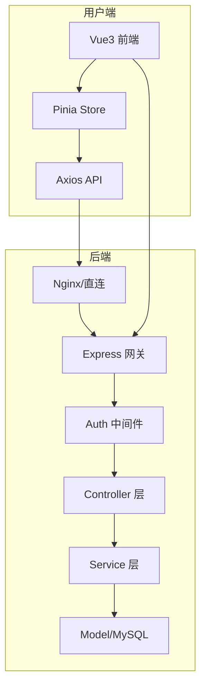
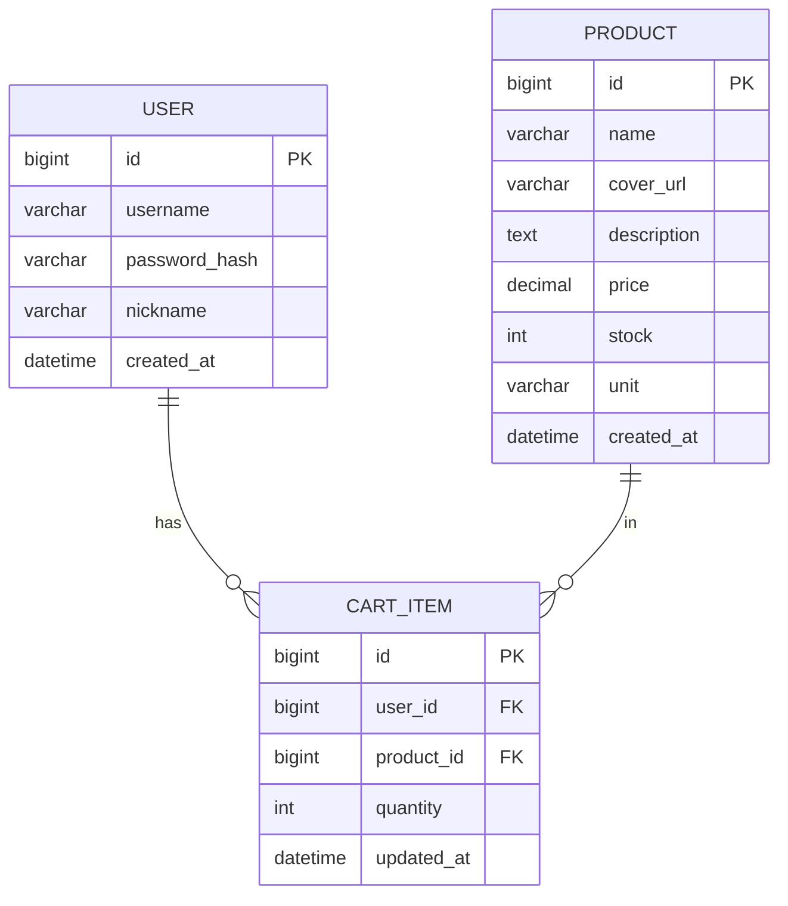

# 水果店项目设计文档

## 1. 系统架构

## 2. ER 图

## 3. 接口清单

### 3.1 认证 AuthController
| 方法 | 路径 | 说明 |
|------|------|------|
| POST | /api/auth/login | 登录，返回 JWT |
| POST | /api/auth/register | 注册 |
| GET  | /api/auth/me | 当前用户信息（需 Token） |

### 3.2 商品 ProductController
| 方法 | 路径 | 说明 |
|------|------|------|
| GET  | /api/products | 商品列表（分页） |
| GET  | /api/products/:id | 商品详情 |

### 3.3 购物车 CartController
| 方法 | 路径 | 说明 |
|------|------|------|
| GET    | /api/cart | 购物车列表（需 Token） |
| POST   | /api/cart | 添加/更新购物车项（需 Token） |
| DELETE | /api/cart/:productId | 删除购物车项（需 Token） |

## 4. UI/UX 规范

- **主色调**：`#2e7d32`（绿色，水果/自然感），辅助色 `#ff9800`（橙）。
- **字体**：系统字体栈 `-apple-system, BlinkMacSystemFont, "Segoe UI", Roboto, "Helvetica Neue", Arial`，正文 14px，标题 18px/20px。
- **圆角**：卡片 12px，按钮 8px。
- **间距**：8px / 16px / 24px 栅格。
- **卡片**：浅灰背景 `#f5f5f5`，卡片白底 + 阴影 `0 1px 3px rgba(0,0,0,0.08)`，边框可选 `1px solid #eee`。
- **交互**：按钮 Hover 加深、Loading 状态；成功/失败 Toast（Element Plus Message）。
